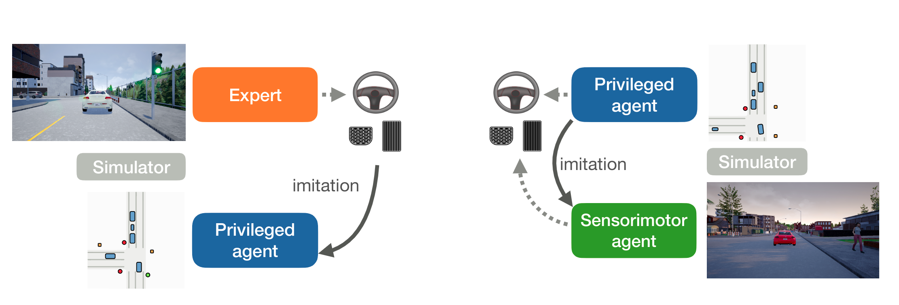

# Learning by Cheating

This repo is the implemention of paper Learning by Cheating in CARLA 0.9.6.


> [**Learning by Cheating**](https://arxiv.org/abs/1912.12294)    
> Dian Chen, Brady Zhou, Vladlen Koltun, Philipp Kr&auml;henb&uuml;hl,        
> [Conference on Robot Learning](https://www.robot-learning.org) (CoRL 2019)      
> _arXiv 1912.12294_

Code in CARLA 0.9.5 is coming soon.


## Reference
If you find this repo to be useful in your research, please consider citing our work
```
@inproceedings{chen2019lbc,
  author    = {Dian Chen and Brady Zhou and Vladlen Koltun and Philipp Kr\"ahenb\"uhl},
  title     = {Learning by Cheating},
  booktitle = {Conference on Robot Learning (CoRL)},
  year      = {2019},
}
```

## CARLA Challenge
Checkout our submission to the [2020 CARLA Challenge](https://github.com/bradyz/2020_CARLA_challenge)!

## Video
For a summarization of this project, please checkout our [video](https://youtu.be/u9ZCxxD-UUw).

## Installation
Please refer to [INSTALL.md](INSTALL.md) for setup instructions. 

### Quick start
We provide a quick script [here](quick_start.sh) in case you would like to skip compiling and directly use the official binary release:

```bash
# Download CARLA 0.9.6
wget http://carla-assets-internal.s3.amazonaws.com/Releases/Linux/CARLA_0.9.6.tar.gz
mkdir carla_lbc
tar -xvzf CARLA_0.9.6.tar.gz -C carla_lbc
cd carla_lbc

# Download LBC
git init
git remote add origin https://github.com/dianchen96/LearningByCheating.git
# rename the LICENSE file to avoid conflicts during the pull
mv LICENSE CARLA_LICENSE 
git pull origin release-0.9.6
wget http://www.cs.utexas.edu/~dchen/lbc_release/navmesh/Town01.bin
wget http://www.cs.utexas.edu/~dchen/lbc_release/navmesh/Town02.bin
mv Town*.bin CarlaUE4/Content/Carla/Maps/Nav/

# Create conda environment
conda env create -f environment.yml
conda activate carla

# Install carla client
cd PythonAPI/carla/dist
rm carla-0.9.6-py3.5-linux-x86_64.egg
wget http://www.cs.utexas.edu/~dchen/lbc_release/egg/carla-0.9.6-py3.5-linux-x86_64.egg
easy_install carla-0.9.6-py3.5-linux-x86_64.egg

# Download model checkpoints
cd ../../..
mkdir -p ckpts/image
cd ckpts/image
wget http://www.cs.utexas.edu/~dchen/lbc_release/ckpts/image/model-10.th
wget http://www.cs.utexas.edu/~dchen/lbc_release/ckpts/image/config.json
cd ../..
mkdir -p ckpts/priveleged
cd ckpts/priveleged
wget http://www.cs.utexas.edu/~dchen/lbc_release/ckpts/privileged/model-128.th
wget http://www.cs.utexas.edu/~dchen/lbc_release/ckpts/privileged/config.json
cd ../..
```

Once you are done with that, you need to start the Carla Server and the LbC agent.

### Running the Carla Server

 - Open up a terminal.
 - Inside the carla directory run `./CarlaUE4.sh -fps=10 -benchmark`. 

### Running the LbC Agent

 - Open up another terminal to run the LbC agent.

 - To run the LbC agent, your `PYTHONPATH` needs to be set correctly. Make sure `[CARLA PATH]/PythonAPI` is in your `PYTHONPATH`
   If you are inside the carla_lbc directory (created above), you can run the following command.

```
export PYTHONPATH="`pwd`/PythonAPI:$PYTHONPATH" 
```

 - After ensuring your `PYTHONPATH` is set correctly, run this:

```
CUDA_VISIBLE_DEVICES="0" python benchmark_agent.py --suite=town2 --model-path=ckpts/image/model-10.th --show
```
 - Now you can see the the image model drive in the testing town!

## Benchmark Results (0.9.6 w/ pedestrians fix)
Since CARLA does not have an official 0.9+ version that supports pedestrian crossing, we modified the most up-to-date CARLA (0.9.6) to support pedestrian crossing to compare to the original benchmark.

All our changes are only on the client side, and summarized below:

1. Modified navigation mesh, such that pedestrians walk and "cross" the streets.
2. Modified navigation, such that pedestrians avoid cars.
3. Added pedestrian teleport functionality, such that they are teleported if stuck and causing a traffic jam.

[Our CARLA 0.9.6](https://github.com/dianchen96/carla/tree/dev-peds)

We are cleaning-up our CARLA 0.9.5 implementation, and the code is coming soon.

#### Autopilot

|                   | Training | New weather | New town | New town & weather  |
|-------------------|----------|-------------|----------|---------------------|
| CoRL Straight     |   100    |      100    |    100   |       100           |
| CoRL Turning      |   100    |      100    |    100   |       100           |
| CoRL Nav          |   100    |      100    |    100   |       100           |
| CoRL Nav Dynamic  |   100    |      100    |    100   |       100           |

#### Priviledged(cheating) Agent

|                   | Training  | New weather | New town | New town & weather  |
|-------------------|-----------|-------------|----------|---------------------|
| CoRL Straight     |   100     |      100     |    100    |       100        |
| CoRL Turning      |   100     |      100     |    100    |       100         |
| CoRL Nav          |   100     |      100     |    99     |       100         |
| CoRL Nav Dynamic  |   100     |      100     |    100    |       100         |

#### Stage 1(purely offline) Agent

|                   | Training | New weather | New town   | New town & weather  |
|-------------------|----------|-------------|------------|---------------------|
| CoRL Straight     |   100    |      100    |    100     |       100        |
| CoRL Turning      |   96     |      100    |    95      |       98         |
| CoRL Nav          |   94     |      98     |    94      |       98            |
| CoRL Nav Dynamic  |   95     |      92     |    88      |       90           |

#### Stage 2(online fine-tuned) Agent

|                   | Training | New weather | New town   | New town & weather  |
|-------------------|----------|-------------|------------|---------------------|
| CoRL Straight     |   100    |      100    |    100     |       100           |
| CoRL Turning      |   100    |      96     |    100     |       100           |
| CoRL Nav          |   100    |      100    |    98      |       100           |
| CoRL Nav Dynamic  |   100    |      100    |    99      |       100           |

## Training Models
### Data collection
```bash
python data_collector.py --dataset_path=[PATH]
```
Use `--n_episodes` to select the number of trajectories you want to collect. Make sure `[CARLA PATH]/PythonAPI` is in your python path, or add `PYTHONPATH=[CARLA PATH]/PythonAPI` before the call.

### Train a privileged agent
```bash
cd training
python train_birdview.py --dataset_path=[DATA PATH] --log_dir=[LOG DIR]
```
- `--dataset_path` expects a folder that contains a `train` and a `val` subdirectory, where each of these should contain `.lmdb` trajectory files collected from the data collection script.

- `--log_dir` will store the model checkpoints, the hyperparameter configurations, and the training losses and visualizations. You can track your model using `tensorboard --log_dir [LOG_DIR]` to monitor the progress. You should expect a validation loss smaller than `5e-3` for a well trained a privileged model.


### Train an image agent
#### Stage 0 (warm-up)
```bash
cd training
python train_image_phase0.py --dataset_path=[DATA PATH] --log_dir=[LOG DIR] --pretrained --teacher_path=[TEACHER PATH]
```
- `--teacher_path` expects the path to a privileged agent `.th` checkpoint. Make sure `config.json` from priveleged agent trainig lies in the same directory as the checkpoint


#### Stage 1
```bash
cd training
python train_image_phase1.py --dataset_path=[DATA PATH] --log_dir=[LOG DIR] --teacher_path=[TEACHER PATH] --ckpt=[CKPT PATH]
```
- `--ckpt` expects the path to the stage 0 `.th` checkpoint.

#### Stage 2 (dagger)
```bash
cd training
python train_image_phase2.py --teacher_path=[TEACHER PATH] --ckpt=[CKPT PATH] --log_dir=[LOG DIR]
```

- `--ckpt` expects the path to the stage 1 `.th` checkpoint.

For all stages you can track your model using `tensorboard --log_dir [LOG_DIR]` to monitor the progress. 


#### Note
Due to randomness, the retrained model will not be the same as the published, and you will likely need to retune the controller parameters.

### Benchmarking models
1. Start a CARLA server instance `./Carla.sh -fps=10 -benchmark -world-port=[PORT NUM]`
2. Run `python benchmark_agent.py --suite=[SUITE NAME] --port=[PORT NUM] --model_path=[MODEL PATH]`. This will create a `summary.csv` in `/benchmark` and benchmarking videos in `/benchmark/[SUITE NAME]`.
3. Once benchmarking is done, use `python view_benchmark_results.py [MODEL_PATH]/benchmark/[MODEL NAME]` to print a results table like the ones shown below.

####
Note that CARLA is non-deterministic, since currently we cannot control the random seeds in the server. Our client-side random seed makes sure the other vehicles have deterministic initial positions, but the decision of whether to turn left or right at intersections is non-deterministic.

## Detailed Benchmark Results
### Autopilot
```
╔Performance of autopilot════════════╦═════════╦═══════╗
║ Suite Name          ║ Success Rate ║ Total   ║ Seeds ║
╠═════════════════════╬══════════════╬═════════╬═══════╣
║ FullTown01-v1       ║ 100          ║ 100/100 ║ 0     ║
║ FullTown01-v2       ║ 100          ║ 50/50   ║ 0     ║
║ FullTown01-v3       ║ 100          ║ 100/100 ║ 0     ║
║ FullTown01-v4       ║ 100          ║ 50/50   ║ 0     ║
║ FullTown02-v1       ║ 100          ║ 100/100 ║ 0     ║
║ FullTown02-v2       ║ 100          ║ 50/50   ║ 0     ║
║ FullTown02-v3       ║ 100          ║ 100/100 ║ 0     ║
║ FullTown02-v4       ║ 100          ║ 50/50   ║ 0     ║
║ NoCrashTown01-v1    ║ 100.0 ± 0.0  ║ 300/300 ║ 0,1,2 ║
║ NoCrashTown01-v2    ║ 100.0 ± 0.0  ║ 150/150 ║ 0,1,2 ║
║ NoCrashTown01-v3    ║ 98.7 ± 0.6   ║ 296/300 ║ 0,1,2 ║
║ NoCrashTown01-v4    ║ 99.3 ± 1.2   ║ 149/150 ║ 0,1,2 ║
║ NoCrashTown01-v5    ║ 86.3 ± 3.2   ║ 259/300 ║ 0,1,2 ║
║ NoCrashTown01-v6    ║ 82.7 ± 6.1   ║ 124/150 ║ 0,1,2 ║
║ NoCrashTown02-v1    ║ 100.0 ± 0.0  ║ 300/300 ║ 0,1,2 ║
║ NoCrashTown02-v2    ║ 100.0 ± 0.0  ║ 150/150 ║ 0,1,2 ║
║ NoCrashTown02-v3    ║ 99.0 ± 1.0   ║ 297/300 ║ 0,1,2 ║
║ NoCrashTown02-v4    ║ 98.0 ± 2.0   ║ 147/150 ║ 0,1,2 ║
║ NoCrashTown02-v5    ║ 60.0 ± 2.6   ║ 180/300 ║ 0,1,2 ║
║ NoCrashTown02-v6    ║ 58.7 ± 7.6   ║ 88/150  ║ 0,1,2 ║
║ StraightTown01-v1   ║ 100          ║ 100/100 ║ 0     ║
║ StraightTown01-v2   ║ 100          ║ 50/50   ║ 0     ║
║ StraightTown02-v1   ║ 100          ║ 100/100 ║ 0     ║
║ StraightTown02-v2   ║ 100          ║ 50/50   ║ 0     ║
║ TurnTown01-v1       ║ 100          ║ 100/100 ║ 0     ║
║ TurnTown01-v2       ║ 100          ║ 50/50   ║ 0     ║
║ TurnTown02-v1       ║ 100          ║ 100/100 ║ 0     ║
║ TurnTown02-v2       ║ 100          ║ 50/50   ║ 0     ║
╚═════════════════════╩══════════════╩═════════╩═══════╝
```

### Priviledged(cheating) Agent
[Model checkpoints](http://cs.utexas.edu/~dchen/lbc_release/ckpts/privileged/privileged.zip)

```
╔Performance of model-512════════════╦═════════╦═══════╗
║ Suite Name          ║ Success Rate ║ Total   ║ Seeds ║
╠═════════════════════╬══════════════╬═════════╬═══════╣
║ FullTown01-v1       ║ 100          ║ 100/100 ║ 0     ║
║ FullTown01-v2       ║ 100          ║ 50/50   ║ 0     ║
║ FullTown01-v3       ║ 100          ║ 100/100 ║ 0     ║
║ FullTown01-v4       ║ 100          ║ 50/50   ║ 0     ║
║ FullTown02-v1       ║ 100          ║ 100/100 ║ 0     ║
║ FullTown02-v2       ║ 100          ║ 50/50   ║ 0     ║
║ FullTown02-v3       ║ 99           ║ 99/100  ║ 0     ║
║ FullTown02-v4       ║ 100          ║ 50/50   ║ 0     ║
║ NoCrashTown01-v1    ║ 100.0 ± 0.0  ║ 300/300 ║ 0,1,2 ║
║ NoCrashTown01-v2    ║ 100.0 ± 0.0  ║ 150/150 ║ 0,1,2 ║
║ NoCrashTown01-v3    ║ 96.3 ± 3.1   ║ 289/300 ║ 0,1,2 ║
║ NoCrashTown01-v4    ║ 97.3 ± 3.1   ║ 146/150 ║ 0,1,2 ║
║ NoCrashTown01-v5    ║ 80.2 ± 4.9   ║ 239/298 ║ 0,1,2 ║
║ NoCrashTown01-v6    ║ 81.3 ± 5.8   ║ 122/150 ║ 0,1,2 ║
║ NoCrashTown02-v1    ║ 100.0 ± 0.0  ║ 300/300 ║ 0,1,2 ║
║ NoCrashTown02-v2    ║ 100.0 ± 0.0  ║ 150/150 ║ 0,1,2 ║
║ NoCrashTown02-v3    ║ 95.0 ± 1.0   ║ 285/300 ║ 0,1,2 ║
║ NoCrashTown02-v4    ║ 93.3 ± 2.3   ║ 140/150 ║ 0,1,2 ║
║ NoCrashTown02-v5    ║ 45.5 ± 8.4   ║ 135/297 ║ 0,1,2 ║
║ NoCrashTown02-v6    ║ 45.3 ± 9.5   ║ 68/150  ║ 0,1,2 ║
║ StraightTown02-v1   ║ 100          ║ 100/100 ║ 0     ║
║ StraightTown02-v2   ║ 100          ║ 50/50   ║ 0     ║
║ TurnTown02-v1       ║ 100          ║ 100/100 ║ 0     ║
║ TurnTown02-v2       ║ 100          ║ 50/50   ║ 0     ║
╚═════════════════════╩══════════════╩═════════╩═══════╝
```

### Stage 1(purely offline) Agent

```
╔Performance of model-32═══════════╦═════════╦═══════╗
║ Suite Name        ║ Success Rate ║ Total   ║ Seeds ║
╠═══════════════════╬══════════════╬═════════╬═══════╣
║ FullTown01-v1     ║ 93           ║ 93/100  ║ 0     ║
║ FullTown01-v2     ║ 98           ║ 49/50   ║ 0     ║
║ FullTown01-v3     ║ 94           ║ 94/100  ║ 0     ║
║ FullTown01-v4     ║ 96           ║ 48/50   ║ 0     ║
║ FullTown02-v1     ║ 94           ║ 94/100  ║ 0     ║
║ FullTown02-v2     ║ 96           ║ 48/50   ║ 0     ║
║ FullTown02-v3     ║ 92           ║ 92/100  ║ 0     ║
║ FullTown02-v4     ║ 94           ║ 47/50   ║ 0     ║
║ NoCrashTown01-v1  ║ 88.3 ± 1.5   ║ 265/300 ║ 0,1,2 ║
║ NoCrashTown01-v2  ║ 91.3 ± 3.1   ║ 137/150 ║ 0,1,2 ║
║ NoCrashTown01-v3  ║ 74.3 ± 3.8   ║ 223/300 ║ 0,1,2 ║
║ NoCrashTown01-v4  ║ 71.3 ± 4.6   ║ 107/150 ║ 0,1,2 ║
║ NoCrashTown01-v5  ║ 27.7 ± 3.5   ║ 83/300  ║ 0,1,2 ║
║ NoCrashTown01-v6  ║ 24.7 ± 2.3   ║ 37/150  ║ 0,1,2 ║
║ NoCrashTown02-v1  ║ 85.0 ± 2.6   ║ 255/300 ║ 0,1,2 ║
║ NoCrashTown02-v2  ║ 80.7 ± 2.3   ║ 121/150 ║ 0,1,2 ║
║ NoCrashTown02-v3  ║ 64.3 ± 4.0   ║ 193/300 ║ 0,1,2 ║
║ NoCrashTown02-v4  ║ 60.0 ± 4.0   ║ 90/150  ║ 0,1,2 ║
║ NoCrashTown02-v5  ║ 11.7 ± 2.3   ║ 35/300  ║ 0,1,2 ║
║ NoCrashTown02-v6  ║ 11.3 ± 3.1   ║ 17/150  ║ 0,1,2 ║
║ StraightTown01-v1 ║ 100          ║ 100/100 ║ 0     ║
║ StraightTown01-v2 ║ 100          ║ 50/50   ║ 0     ║
║ StraightTown02-v1 ║ 100          ║ 100/100 ║ 0     ║
║ StraightTown02-v2 ║ 100          ║ 50/50   ║ 0     ║
║ TurnTown01-v1     ║ 96           ║ 96/100  ║ 0     ║
║ TurnTown01-v2     ║ 100          ║ 50/50   ║ 0     ║
║ TurnTown02-v1     ║ 97           ║ 97/100  ║ 0     ║
║ TurnTown02-v2     ║ 100          ║ 50/50   ║ 0     ║
╚═══════════════════╩══════════════╩═════════╩═══════╝
```

Note that this is with different controller parameters from what we submitted for CoRL2019, yielding slightly different numbers.

The original raw numbers are shown below

```
╔Performance of model-32═══════════╦═════════╦═══════╗
║ Suite Name        ║ Success Rate ║ Total   ║ Seeds ║
╠═══════════════════╬══════════════╬═════════╬═══════╣
║ FullTown01-v1     ║ 94           ║ 94/100  ║ 0     ║
║ FullTown01-v2     ║ 98           ║ 49/50   ║ 0     ║
║ FullTown01-v3     ║ 95           ║ 95/100  ║ 0     ║
║ FullTown01-v4     ║ 92           ║ 46/50   ║ 0     ║
║ FullTown02-v1     ║ 94           ║ 94/100  ║ 0     ║
║ FullTown02-v2     ║ 98           ║ 49/50   ║ 0     ║
║ FullTown02-v3     ║ 88           ║ 88/100  ║ 0     ║
║ FullTown02-v4     ║ 90           ║ 45/50   ║ 0     ║
║ StraightTown01-v1 ║ 100          ║ 100/100 ║ 0     ║
║ StraightTown01-v2 ║ 100          ║ 50/50   ║ 0     ║
║ StraightTown02-v1 ║ 100          ║ 100/100 ║ 0     ║
║ StraightTown02-v2 ║ 100          ║ 50/50   ║ 0     ║
║ TurnTown01-v1     ║ 96           ║ 96/100  ║ 0     ║
║ TurnTown01-v2     ║ 100          ║ 50/50   ║ 0     ║
║ TurnTown02-v1     ║ 95           ║ 95/100  ║ 0     ║
║ TurnTown02-v2     ║ 98           ║ 49/50   ║ 0     ║
╚═══════════════════╩══════════════╩═════════╩═══════╝
```

### Stage 2(online fine-tuned) Agent
[Model checkpoints](http://cs.utexas.edu/~dchen/lbc_release/ckpts/image/image.zip)

```
╔Performance of model-10══════════╦═════════╦═══════╗
║ Suite Name       ║ Success Rate ║ Total   ║ Seeds ║
╠══════════════════╬══════════════╬═════════╬═══════╣
║ FullTown01-v1    ║ 100          ║ 100/100 ║ 0     ║
║ FullTown01-v2    ║ 100          ║ 50/50   ║ 0     ║
║ FullTown01-v3    ║ 100          ║ 100/100 ║ 0     ║
║ FullTown01-v4    ║ 100          ║ 50/50   ║ 0     ║
║ FullTown02-v1    ║ 100          ║ 100/100 ║ 0     ║
║ FullTown02-v2    ║ 100          ║ 50/50   ║ 0     ║
║ FullTown02-v3    ║ 98           ║ 98/100  ║ 0     ║
║ FullTown02-v4    ║ 98           ║ 49/50   ║ 0     ║
║ NoCrashTown01-v1 ║ 99.0 ± 0.0   ║ 297/300 ║ 0,1,2 ║
║ NoCrashTown01-v2 ║ 89.3 ± 3.1   ║ 134/150 ║ 0,1,2 ║
║ NoCrashTown01-v3 ║ 97.3 ± 1.2   ║ 292/300 ║ 0,1,2 ║
║ NoCrashTown01-v4 ║ 95.3 ± 3.1   ║ 143/150 ║ 0,1,2 ║
║ NoCrashTown01-v5 ║ 70.0 ± 4.8   ║ 196/280 ║ 0,1,2 ║
║ NoCrashTown01-v6 ║ 62.7 ± 2.3   ║ 94/150  ║ 0,1,2 ║
║ NoCrashTown02-v1 ║ 99.0 ± 0.0   ║ 297/300 ║ 0,1,2 ║
║ NoCrashTown02-v2 ║ 84.7 ± 3.1   ║ 127/150 ║ 0,1,2 ║
║ NoCrashTown02-v3 ║ 93.3 ± 2.1   ║ 280/300 ║ 0,1,2 ║
║ NoCrashTown02-v4 ║ 70.0 ± 2.0   ║ 105/150 ║ 0,1,2 ║
║ NoCrashTown02-v5 ║ 46.1 ± 4.0   ║ 128/278 ║ 0,1,2 ║
║ NoCrashTown02-v6 ║ 32.7 ± 9.5   ║ 49/150  ║ 0,1,2 ║
╚══════════════════╩══════════════╩═════════╩═══════╝
```
Note that this is run with different controller parameters from what we submitted for CoRL2019, yielding slightly better numbers.


The original raw numbers are shown below

[Benchmark results/videos](https://drive.google.com/drive/folders/1CUb9LusS_DfofgJ0NHEfPzDVxmk6KgrR?usp=sharing)

```
╔Performance of model-10═══════════╦═════════╦═══════╗
║ Suite Name        ║ Success Rate ║ Total   ║ Seeds ║
╠═══════════════════╬══════════════╬═════════╬═══════╣
║ FullTown01-v1     ║ 100          ║ 100/100 ║ 0     ║
║ FullTown01-v2     ║ 100          ║ 50/50   ║ 0     ║
║ FullTown01-v3     ║ 100          ║ 100/100 ║ 0     ║
║ FullTown01-v4     ║ 96           ║ 48/50   ║ 0     ║
║ FullTown02-v1     ║ 98           ║ 98/100  ║ 0     ║
║ FullTown02-v2     ║ 100          ║ 50/50   ║ 0     ║
║ FullTown02-v3     ║ 99           ║ 99/100  ║ 0     ║
║ FullTown02-v4     ║ 100          ║ 50/50   ║ 0     ║
║ NoCrashTown01-v1  ║ 97.0 ± 1.0   ║ 291/300 ║ 0,1,2 ║
║ NoCrashTown01-v2  ║ 86.7 ± 4.2   ║ 130/150 ║ 0,1,2 ║
║ NoCrashTown01-v3  ║ 93.3 ± 0.6   ║ 280/300 ║ 0,1,2 ║
║ NoCrashTown01-v4  ║ 87.3 ± 3.1   ║ 131/150 ║ 0,1,2 ║
║ NoCrashTown01-v5  ║ 70.7 ± 4.5   ║ 212/300 ║ 0,1,2 ║
║ NoCrashTown01-v6  ║ 63.3 ± 3.1   ║ 95/150  ║ 0,1,2 ║
║ NoCrashTown02-v1  ║ 99.7 ± 0.6   ║ 299/300 ║ 0,1,2 ║
║ NoCrashTown02-v2  ║ 70.0 ± 4.0   ║ 105/150 ║ 0,1,2 ║
║ NoCrashTown02-v3  ║ 94.0 ± 3.0   ║ 281/299 ║ 0,1,2 ║
║ NoCrashTown02-v4  ║ 62.0 ± 2.0   ║ 93/150  ║ 0,1,2 ║
║ NoCrashTown02-v5  ║ 51.3 ± 3.1   ║ 154/300 ║ 0,1,2 ║
║ NoCrashTown02-v6  ║ 38.7 ± 6.4   ║ 58/150  ║ 0,1,2 ║
║ StraightTown01-v1 ║ 100          ║ 100/100 ║ 0     ║
║ StraightTown01-v2 ║ 100          ║ 50/50   ║ 0     ║
║ StraightTown02-v1 ║ 100          ║ 100/100 ║ 0     ║
║ StraightTown02-v2 ║ 100          ║ 50/50   ║ 0     ║
║ TurnTown01-v1     ║ 100          ║ 100/100 ║ 0     ║
║ TurnTown01-v2     ║ 96           ║ 48/50   ║ 0     ║
║ TurnTown02-v1     ║ 100          ║ 100/100 ║ 0     ║
║ TurnTown02-v2     ║ 100          ║ 50/50   ║ 0     ║
╚═══════════════════╩══════════════╩═════════╩═══════╝
```

## License
This repo is released under the MIT License (please refer to the LICENSE file for details). Part of the PythonAPI and the map rendering code is borrowed from the official [CARLA](https://github.com/carla-simulator/carla) repo, which is under MIT license. The image augmentation code is borrowed from [Coiltraine](https://github.com/felipecode/coiltraine) which is released under MIT license.
